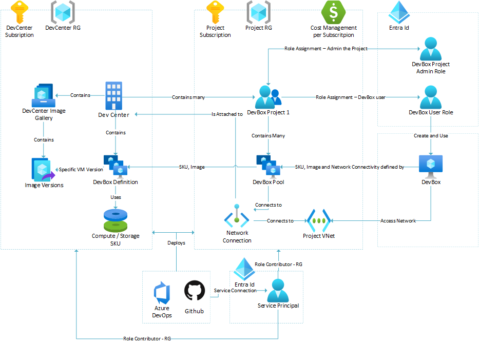

# Azure DevBox Automations
Objective is to show how you could implement automations around Provisioning DevBox, including RBAC roles

# Architecture

Some considerations:
- DevCenter and DevBox Project are on different subscriptions
- With that, users are able to control DevBox costs per Projects / Subscription

# Pre Reqs
- Have VNet and SubNet for each Project
- Have a user with Admin permissions on Tenant - required to create DevBox and run the scenarios

# Automation - Deploy IaC using Bicep Templates using Service Principal:
- Deploy DevBox via IaC using bicep templates
- 1) mainDevCenter.bicep: Deploy the DevCenter and all related resources: Image Gallery and DevBox Definitions
- 2) mainProject.bicep: Deploy the Project and Specific Resources: Project, Project Role Assignments, Network Connection and DevBox Pools

## To run this Scenario
Execute the Powershell scripts in the "script" folder

## Access Permissions for the Service Principal to deploy the Resources 
- Grant Service Principal the following access permissions:
    
| Responsibilities / Actions            | Subscription       | RBAC Role            | Scope                                                  |
| ------------------------------------- | ------------------ | -------------------- | ------------------------------------------------------ |
| Create and Manage the DevCenter (also, DevBox defition, Add / Remove Project from DevCenter and Attach Network Connection)   | DevCenter Subscription | Owner or Contributor | IT4IT Subscription or DevCenter Resource Group         |
| Create and Manage the Network Connections | VNet Subscription | Owner or Contributor | VNet Subscription or Resource Group |
| Attach / Remove Network Connection to a Dev Center | DevCenter Subscription  | Owner or Contributor | DevCenter Subscription, Resource Group or Resource |
| Create or Delete DevBox Project | DevCenter and Project Subscriptions  | Owner or Contributor | Subscription, Resource Group or Resource |

# References:
- This repo used the scripts from repo: https://github.com/PieterbasNagengast/Azure-DevBox
- DevBox documentation for Permissions: https://learn.microsoft.com/en-us/azure/dev-box/ 
- Bicep docs: https://learn.microsoft.com/en-us/azure/azure-resource-manager/bicep/deploy-to-resource-group?tabs=azure-cli

